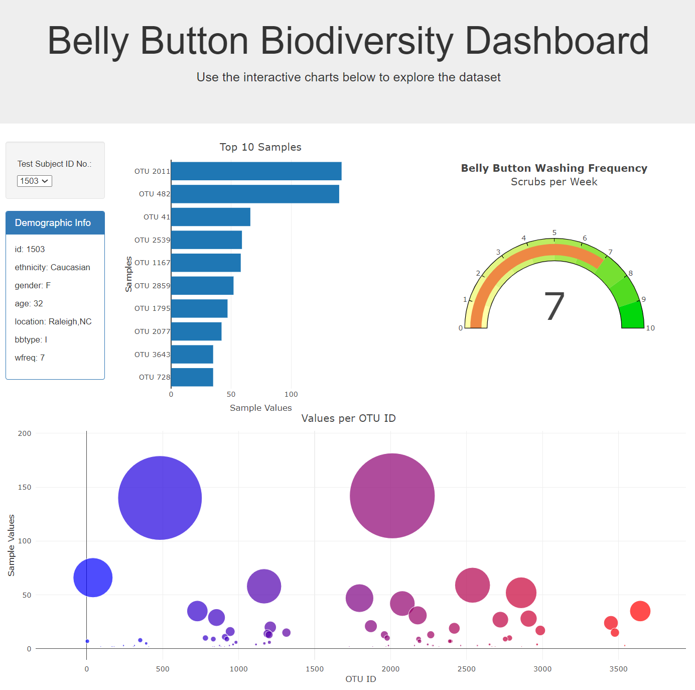

# Challenge 14 - JavaScript, D3, Plotly

This challenge demonstrates the usage of JavaScript to display data on a interactive dashboard. The JSON data is read from an external site using `D3`. The drop down is populated and the three charts are created with `Plotly`. When a new option from the drop down is selected, the charts will update.

---

- [Copy of the json data](data/samples.json)
- [app.js source file](static/js/app.js)

There is a drop down box where a user can select the ID of a test subject to see different graphs displaying the associated data, along with some information about the test subject.

There are three graphs:
1. Bar Chart
    - Shows the top 10 (or all available if less) OTU Samples and their values.
    - Hover over to see the exact value and taxa of the sample.
2. Bubble Chart
    - Shows all OTUs with the bubble being scaled by Sample Values
    - Hover over to see the exact value and taxa of the sample.
3. Gauge Chart
    - Shows a gauge of Belly Button Washing per Week for the selected test subject.

The website can be accessed at this link: [https://zachaa.github.io/belly-button-challenge/](https://zachaa.github.io/belly-button-challenge/)

## Website Preview

